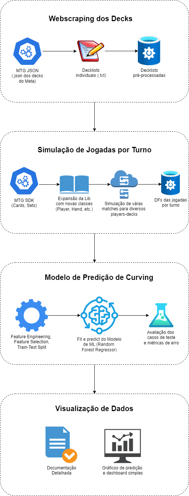

# Magic Curve ML

Este projeto integra uma API para extração dos dados de cartas e conjuntos do jogo de cartas **Magic: The Gathering**. Esses dados alimentarão um simulador de jogadas que, por sua vez, alimentará um modelo de Machine Learning que calculará a probabilidade do jogador curvar (maximizar suas jogadas ao longo dos turnos).

## Integrantes

- Antonio Eduardo de Oliveira Lima
- Gustavo Mendonça Ferratti
- Luiz Claudio Santana Barbosa
- Mauricio de Araujo Pintor

## Visão Geral do Projeto

Para obter mais detalhes sobre o projeto, consulte a pasta `mtg-project/docs`.



## Configuração Inicial

### Pré-requisitos

- **Python 3.12** instalado em sua máquina (versão recomendada).
- **pymake** instalado (estamos utilizando `pymake` em vez do `make` tradicional).
- **Credenciais do Google Cloud Platform (GCP)** configuradas em um arquivo `.env` na sua máquina.
  - As credenciais do GCP são necessárias para acesso aos recursos do Google Cloud utilizados no projeto.
  - Certifique-se de ter uma conta GCP e as permissões adequadas.

### Configuração das Credenciais do GCP

1. Obtenha suas credenciais do GCP:
   - Acesse o console do GCP e faça o download do arquivo de credenciais JSON para a conta de serviço apropriada.

2. Configure o arquivo `.env`:
   - Crie um arquivo chamado `.env` na raiz do projeto (ou no diretório apropriado conforme sua estrutura).
   - Adicione a variável de ambiente apontando para o caminho do arquivo de credenciais JSON:

     ```bash
     GOOGLE_APPLICATION_CREDENTIALS=path/to/your/credentials.json
     ```

3. Atualize o `credentials.yml` do Kedro:
   - No arquivo `conf/base/credentials.yml` (não commitado intencionalmente), referencie as variáveis de ambiente necessárias e defina a data de execução:

     ```yaml
     gcs_credentials:
        client_kwargs:
            project: "mtg-project-437014"
            token: "C:\\Users\\.env\\mtg-project-437014-423d6155e8aa.json"
     ```

   - Isso permite que o Kedro acesse as credenciais do GCP utilizando as variáveis de ambiente definidas no `.env`.

### Criação do Ambiente Virtual

#### Usando `venv`

Para criar o ambiente virtual utilizando o módulo `venv` do Python, execute o comando abaixo:

```bash
make create-env
```

Este comando irá:

1. Criar um ambiente virtual na pasta venv/.
2. Atualizar o pip dentro do ambiente virtual.
3. Instalar todas as dependências listadas em mtg-project/src/mtg_project/requirements.txt.

Após a criação do ambiente, ative-o com:

No Windows:

```bash
venv\Scripts\activate
```

No Linux ou macOS:

```bash
source venv/bin/activate
```

### Usando `conda`

Se preferir usar o Conda, você pode instalar o Miniconda em sua máquina.

1. Instale o Miniconda:

Faça o download do instalador do Miniconda para seu sistema operacional no site oficial: Miniconda Download.

2. Crie um novo ambiente Conda:

```bash
conda create -n mtg_env python=3.12
```

3. Ative o ambiente:

```bash
conda activate mtg_env
```

4. Instale as dependências:

```bash
pip install -r mtg-project/src/mtg_project/requirements.txt
```

5. Executar o Kedro:

```bash
kedro run
```

Observação: Certifique-se de que o ambiente virtual correto esteja ativado para todos os comandos e execuções.

### Execução do Projeto

Para executar o pipeline do projeto utilizando o Kedro, utilize o comando:

```bash
make run
```

Este comando irá:

1. Navegar até a pasta mtg-project.
2. Executar o pipeline do Kedro através do ambiente virtual.

Nota: Caso esteja utilizando o Conda, certifique-se de que o ambiente mtg_env esteja ativo antes de executar o kedro run.

### Configurações Adicionais

#### Alterando a Data de Execução

Para mudar a data de rodagem do pipeline, você pode editar o arquivo conf/base/globals.yml e alterar a variável _run_key:

```yaml
_gcp:
  bucket_url: "gcs://mana_curve_bucket"
_run_key: "YYYY-MM-DD"
```

Substitua YYYY-MM-DD pela data desejada no formato ano-mês-dia.

Uso de Paths Locais em vez do GCP

Se você não quiser utilizar o Google Cloud Platform, será necessário atualizar o catálogo do Kedro para utilizar paths locais. Para isso:

1. Abra o arquivo conf/base/catalog.yml.
2. Substitua os datasets que apontam para o GCP por paths locais no seu sistema de arquivos.
3. Certifique-se de que os dados necessários estejam disponíveis nos locais especificados.

### Desenvolvimento

#### Limpando Arquivos Temporários

Para limpar arquivos temporários como __pycache__, .pytest_cache e arquivos compilados .pyc, utilize o comando:

```bash
pymake clean
```

#### Rodando Linters

Linters são ferramentas que ajudam a manter a qualidade do código, verificando erros e garantindo conformidade com as boas práticas de codificação.

Para aplicar automaticamente correções de formatação e verificar o código, utilize o comando:

```bash
pymake lint-all
```

Este comando executa as seguintes ferramentas:

- Black: Formata o código automaticamente.
- Flake8: Verifica a conformidade do código com as convenções do Python.
- Isort: Ordena as importações no código.

### Trabalhando com Notebooks

Para trabalhar com Jupyter Notebooks na pasta /notebooks, certifique-se de que seu ambiente virtual esteja ativo para garantir que todas as dependências necessárias estão disponíveis.

Para melhor organização, convencionamos que cada desenvolvedor terá sua pasta dentro de notebooks/, facilitando o desenvolvimento sem sobrescritas e conflitos de git.

Os notebooks permitem uma interação direta com o código, facilitando a visualização de dados e resultados de forma interativa, sendo ideal para experimentos e análises exploratórias. Não é um requisito se ater estritamente às melhores práticas de codificação nos notebooks (embora seja recomendado). Já nos scripts de produção (.py), o rigor será maior.

### Contribuindo

Para contribuir com o projeto, siga os passos abaixo:

1. Fork o repositório para sua conta no GitHub.
2. Clone o fork para sua máquina local.
3. Crie uma branch para suas modificações, nomeando-a de forma que reflita a natureza das mudanças.
4. Faça suas alterações e commit com mensagens claras e descritivas.
5. Push suas mudanças para seu fork no GitHub.
6. Abra um Pull Request do seu fork para o repositório principal. Certifique-se de descrever as mudanças realizadas e qualquer outra informação que facilite a avaliação do PR.

Sua contribuição será revisada e, se apropriada, mesclada ao projeto principal.

### Observações Adicionais

- Python 3.12: A versão recomendada do Python para este projeto é a 3.12. Certifique-se de que esta versão está instalada e configurada em sua máquina.
- Kedro: O projeto utiliza o Kedro para organização e execução dos pipelines de dados. Familiarize-se com o Kedro para contribuir de forma mais eficaz.
- pymake: Estamos utilizando o pymake em vez do make tradicional. Certifique-se de que o pymake esteja instalado em seu sistema para utilizar os comandos make descritos neste README.
- Ambiente Virtual: Garantir que o ambiente virtual esteja ativo é crucial para evitar conflitos de dependências e garantir que todas as bibliotecas necessárias estejam disponíveis.
- Credenciais do GCP: A integração com serviços do Google Cloud requer que as credenciais estejam corretamente configuradas. Não compartilhe suas credenciais públicas e mantenha-as seguras.
- Variáveis de Ambiente: Utilize o arquivo .env para armazenar variáveis de ambiente sensíveis e evite commitá-lo no controle de versão. Adicione o .env ao seu .gitignore para evitar que seja enviado ao repositório.
- Documentação Adicional: Para mais detalhes sobre o projeto, consulte a pasta mtg-project/docs, onde você encontrará documentação adicional, incluindo detalhes técnicos e especificações.

Caso tenha alguma dúvida ou encontre algum problema, sinta-se à vontade para abrir uma issue no repositório ou entrar em contato com um dos integrantes do projeto.

Bom desenvolvimento!
