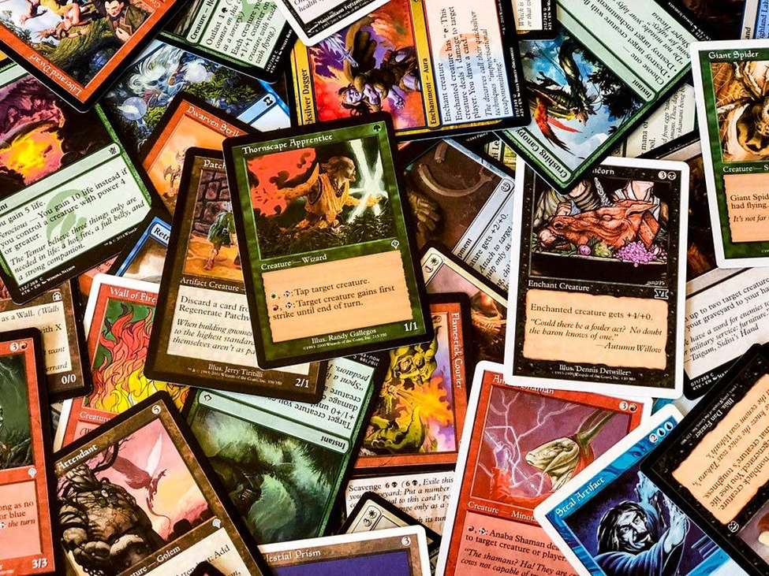
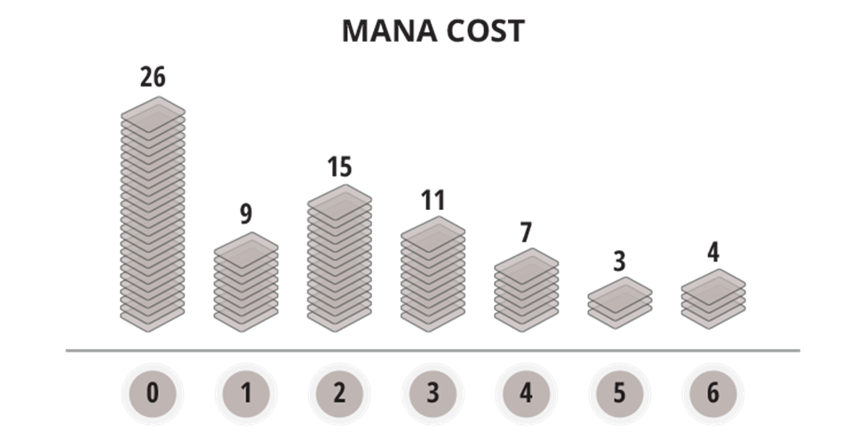
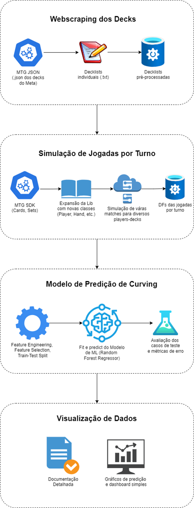
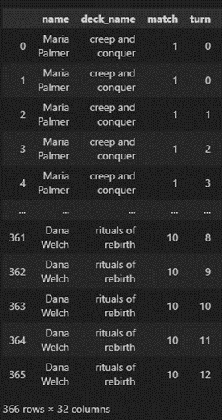
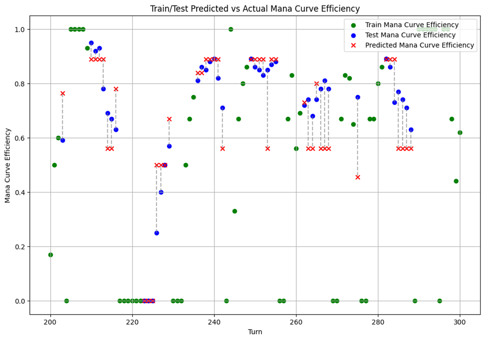

# Magic The Gathering: Mana Curve Predictor

# Breve introdução à Magic: The Gathering

Magic: The Gathering (MTG) é um jogo de cartas colecionáveis criado por Richard Garfield e lançado pela Wizards of the Coast em 1993. Considerado o primeiro jogo de cartas do gênero, MTG revolucionou o mundo dos jogos de tabuleiro e de cartas ao introduzir um sistema inovador de combate estratégico e colecionismo. No jogo, os jogadores assumem o papel de "planeswalkers", magos poderosos que invocam criaturas, lançam feitiços e utilizam artefatos para derrotar o oponente. Ao longo das décadas, MTG expandiu sua popularidade global, evoluindo com novos sets de cartas, mecânicas complexas e torneios competitivos de alto nível, estabelecendo-se como um dos jogos mais influentes da história. Em 2018, a Wizards of the Coast lançou Magic: The Gathering Arena, uma plataforma digital que trouxe o jogo para um novo público, oferecendo uma experiência online acessível e mantendo a profundidade estratégica do formato físico. Se você é novo neste universo e deseja saber mais, acesse o canal do YouTube [UMotivo](https://www.youtube.com/watch?v=-ZmT8aS0ziY&list=PL484-wi9YYOK4x1KFN-fZMqwRgRD0nQVA) de André Manenti. Muito carinho envolvido <3

# O que é Mana Curving?

Mana curving é um conceito fundamental em Magic: The Gathering. Ele está relacionado à maneira como os jogadores usam seus recursos, mais especificamente o mana, para jogar suas cartas ao longo da partida. No jogo, cada carta — seja uma criatura, um feitiço ou outro tipo de magia — tem um custo de mana, que precisa ser pago para ser colocada em jogo. O mana é o recurso básico do jogo, geralmente gerado por terrenos, e os jogadores têm uma quantidade limitada no início, mas conseguem gerar mais mana conforme colocam mais terrenos em jogo.

O conceito de mana curving envolve planejar bem quais cartas jogar em cada turno para usar eficientemente todo o mana disponível em cada turno. No início do jogo, o jogador geralmente tem acesso a apenas 1 ou 2 de mana, então o ideal é ter cartas com custo baixo para usar logo nos primeiros turnos. À medida que o jogo avança, o jogador ganha mais mana por turno, podendo usar cartas mais poderosas e de maior custo. Um "bom curve" significa ter cartas para jogar em todos os turnos, aproveitando ao máximo o mana disponível, sem desperdiçar recursos nem ficar muito tempo sem jogadas.

Se o jogador conseguir fazer uma mana curve eficiente, ele pode manter a pressão sobre o oponente, jogando criaturas ou magias de forma consistente, e aumentando gradualmente o impacto de suas jogadas conforme o jogo avança. Por outro lado, se o jogador não planejar bem seu curve, ele pode acabar com muitas cartas de custo alto no começo do jogo, sem conseguir jogá-las a tempo, ou com cartas fracas nos turnos finais, quando o oponente já está com criaturas e magias mais poderosas no campo de batalha.

Imagem extraída [deste artigo](https://magic.wizards.com/en/news/feature/basics-mana-2015-07-06)

# O Projeto

Este projeto tem por objetivo construir um modelo de machine learning para a previsão da métrica eficiência de mana curving definida pela razão entre a mana gasta acumulada pelo jogador ao longo dos turnos pela mana disponível acumulada. Ou matematicamente:

$$ mana curve efficiency = (cumulative spent mana)/(cumulative mana pool)$$

Este projeto está dividido em quatro grandes etapas, listadas a seguir e detalhadas nos seus respectivos tópicos.

1. *Webscraping*: obtenção dos decks e das informações dos cards e coleções.
2. *Simulação*: jogos individuais para diferentes decklists com regras simplificadas.
3. *Aprendizado de Máquina*: treino de modelo ML para prever a eficiência de mana curving dado os turnos iniciais de uma partida.
4. *Reporting e visualização de Dados*: geração de representações síntese da performance do modelo e das métricas de erro associadas.

# Fontes de Dados de Magic

Para este projeto, utilizamos diferentes fontes de dados:

- [Magic: The Gathering Developer Portal](https://docs.magicthegathering.io/): utilizamos uma API independente que permite aos desenvolvedores acessar dados detalhados sobre o jogo. A API facilita a busca por informações sobre cartas, edições, formatos de torneios e eventos, sendo compatível com diversas linguagens de programação.

- [MTGSDK para Python](https://github.com/MagicTheGathering/mtg-sdk-python): é a biblioteca Python que integra com a API do Magic: The Gathering Developer Portal. Ela simplifica o acesso aos dados, abstraindo as complexidades das chamadas HTTP e fornecendo classes como Card e Set para manipulação das informações sobre cartas e coleções. Apesar de não ter atualizações desde 2019, a biblioteca foi extremamente útil em nosso processo de simulação. Expandimos algumas das suas funcionalidades com novas classes, como Player e Deck, que discutiremos mais detalhadamente na etapa 2 do projeto.

- [MTGJSON](https://mtgjson.com/): um projeto open-source que cataloga todos os dados de Magic: The Gathering em formatos portáteis. O MTGJSON agrega informações de múltiplas fontes e parceiros aprovados, combinando todos esses dados em formatos como JSON, CSV, Parquet, SQL e outros. Embora seja possível acessar esses dados como uma API, os arquivos podem ser bastante grandes, por isso preferimos baixar os arquivos json zipados disponibilizados no upfront da página. Essa biblioteca nos forneceu dados ricos e estruturados sobre decklists para análise e processamento em larga escala.

# Etapa 1: Webscraping

A etapa de webscraping do projeto foi dividida em três fases principais, cada uma encapsulada em uma função específica:

1. Download e extração de arquivos: A primeira função realiza o download de um arquivo ZIP contendo todas as decklists em formato JSON da página MTGJson. Após o download, o arquivo ZIP é automaticamente extraído para uma pasta chamada decks_json, e o arquivo ZIP é excluído após a extração, economizando espaço em disco.

2. Pré-triagem e conversão: A segunda função faz uma triagem inicial dos mais de 2.000 decks extraídos, aplicando critérios específicos, como o número de cartas presentes no deck. Somente os decks que atendem a esses critérios são selecionados e então convertidos do formato JSON para TXT. Essa conversão se mostrou necessária, pois, na etapa de concepção da simulação, todas as funções foram implementadas para trabalhar com arquivos TXT, que é o formato comumente utilizado por páginas que fornecem decklists do metagame. Somente após o desenvolvimento dessa etapa descobrimos a existência da MTGJson.

3. Amostragem aleatória de decks: A terceira função realiza a amostragem aleatória dos decks filtrados, garantindo que cada execução da simulação utilize populações de decks distintas, distribuídas aleatoriamente entre os jogadores. Isso permite maior diversidade nos resultados das simulações, refletindo a variabilidade que encontraríamos em um cenário real de metagame.

# Etapa 2: Simulação

Embora esta etapa não estivesse prevista no roteiro original do projeto, devido à dificuldade de obter dados de partidas reais de Magic: The Gathering com uma qualidade satisfatória, optamos por simular partidas com regras básicas para atingir nosso objetivo inicial. Para isso, criamos classes próprias que reproduzem de maneira adequada várias mecânicas do jogo original, com foco em um único jogador. Como reproduzir uma partida de Magic ipsis litteris seria algo muito complexo, e estávamos interessados apenas na mecânica de curving, fizemos algumas simplificações:

1. Adotamos a premissa de que, se um jogador tiver mana suficiente para conjurar uma mágica, ele sempre a conjurará (mesmo que o momento na partida não seja o ideal).

2. As únicas cartas que entram em campo são terrenos (para calcular o mana disponível); todas as outras magias são conjuradas e vão diretamente para o cemitério.

3. Não consideramos a cor da mana ao jogar magias, apenas a quantidade.

4. Limitamos a simulação a um número máximo de turnos, já que um bom curving geralmente é definido logo nos primeiros turnos da partida.

5. Para simular cartas que permitem jogar terrenos adicionais, incluímos um parâmetro probabilístico que determina se o jogador poderá jogar mais terrenos ou não.

6. Da mesma forma, há um parâmetro probabilístico que define se o jogador pedirá mulligan ou não.

7. Caso o jogador termine o turno com mais de 7 cartas na mão, se houver mais terrenos que magias, ele descartará um terreno; caso contrário, descartará a mágica de maior custo.

Alguns aspectos interessantes das classes criadas:

1. A partir do título em .txt do deck, conseguimos inferir, com base em dicionários de palavras comuns, qual é a cor do deck.

2. Implementamos várias salvaguardas na simulação para garantir seu bom funcionamento. Por exemplo, não é possível conjurar magias antes de a partida começar, e não é permitido pedir mulligan após o início do turno 1, entre outros.

3. Temos uma função que verifica se o deck é válido para o formato atribuído (ex. standard, draft, commander, etc.), levando em consideração o equilíbrio entre terrenos e magias, as cores permitidas para o deck, etc.

A simulação gera dataframes ao longo do tempo tem com as seguintes chaves: nome do jogador, deck atribuído, número da partida e turno (conforme a imagem abaixo).

As demais colunas contêm as principais features monitoradas pela classe PlayerTracker, sendo elas:

- Contador de Mulligan: Quantidade de mulligans realizados pelo jogador.
- Cores do Deck: Representação das cores do deck em código de cor padrão.
- Lands Jogadas: Número de terrenos jogados durante a partida.
- Spells Jogadas: Número de mágicas lançadas durante a partida.
- Mana Gasta: Total de mana utilizada ao longo da partida.
- Tamanho da Mão: Quantidade de cartas na mão do jogador.
- Tamanho da Biblioteca: Número de cartas restantes na biblioteca do jogador.
- Tamanho do Cemitério: Número de cartas no cemitério do jogador.
- Mão Detalhada: Lista completa das cartas na mão, com seus respectivos nomes.
- Cemitério Detalhado: Lista completa das cartas no cemitério, com seus respectivos nomes.

# Etapa 3: Aprendizado de Máquina

## Feature Engineering

Na etapa de feature engineering, foram desenvolvidos diversos tipos de features, incluindo:

- Somas Cumulativas: Para acompanhar o progresso acumulado de variáveis ao longo do tempo.
- Razões de Cartas por Turno: Relação entre terrenos jogados (lands) e mágicas lançadas (spells) a cada turno.
- Variáveis de Lag (1 e 2): Atrasos temporais para o mana gasto e mágicas lançadas, capturando o impacto dos turnos anteriores.
- Variáveis de Rolling Window (n=3): Aplicadas para a eficiência da curva de mana (manacurve efficiency), devido à natureza temporal dos dados.
- Cores do Baralho Codificadas (One-Hot Encoding): Para representar as cores do deck de maneira categórica.

Essas features foram geradas com base nas variáveis monitoradas pela classe PlayerTracker, conforme descrito anteriormente.

## Feature Selection

Para a seleção de features, utilizamos uma matriz de correlação com um threshold pré-definido nos parâmetros. Quando duas features apresentam alta correlação — ou seja, um valor igual ou superior ao threshold estabelecido —, apenas uma delas é mantida como entrada para o modelo. Adicionalmente, implementamos argumentos para forçar a exclusão de features diretamente derivadas do target (como cum_spent_mana e cum_mana_pool), priorizando variáveis de atraso (lags). Também forçamos a inclusão de features consideradas essenciais, como as cores dos baralhos, para evitar que o modelo as descartasse ao longo do processo.

## Train Test Split

Nesta etapa, realizamos a separação dos dados de partidas em conjuntos de treino e teste, garantindo que o modelo não tenha acesso a determinados grupos de jogadores ou turnos mais avançados durante o treinamento. A função filtra o DataFrame com base nas features selecionadas e gera os DataFrames de treino e teste para features e targets. Há opções configuráveis para definir o número de jogadores a serem ocultados do conjunto de teste, bem como para esconder turnos mais avançados através de um limite de turnos pré-definido nos parâmetros. Além disso, fazemos a amostragem aleatória de jogadores para o teste e a aplicação de estratégias de ocultação para evitar a fuga de informações relevantes entre os conjuntos. Tetornamos uma tupla com os DataFrames separados para treino e teste, tanto para as features quanto para o target.

## Fit Model

A função ajusta um modelo de árvore de decisão (DecisionTreeRegressor) para dados com features temporais, utilizando GridSearchCV para realizar o ajuste fino dos hiperparâmetros. A escolha do DecisionTreeRegressor é adequada devido à sua capacidade de capturar relações complexas e não lineares nos dados, algo comum em cenários temporais como o de partidas de Magic. Além disso, ele não requer que os dados sejam escalados ou normalizados, o que facilita o nosso trabalho. A função recebe os DataFrames de treino para as features e o target, e aplica o GridSearchCV com validação cruzada de cinco folds, usando o erro quadrático médio como métrica de avaliação. Isso permite encontrar os melhores hiperparâmetros para o modelo, maximizando sua performance sem risco de overfitting. Após o ajuste, o melhor modelo e seus hiperparâmetros são extraídos, registrados, e salvos em um arquivo .pkl. Para mais informações sobre DecionTreeRegressor veja a [documentação oficial do scikit-learn](https://scikit-learn.org/stable/modules/generated/sklearn.tree.DecisionTreeRegressor.html)

## Metrics and Reporting

Nesta etapa carregamos o modelo .pkl previamente ajustado e salvo, realizamos previsões nos dados de teste, avaliamos o desempenho do modelo e calculamos os valores SHAP para explicar as previsões. SHAP são formas de dar explicabilidade para modelos de árvores como o nosso. As métricas de erro para avaliação do modelo incluem o erro quadrático médio (MSE), o erro absoluto médio (MAE) e o coeficiente de determinação (R²).  Além disso, temos uma função de plotagem de gráficos que salva arquivos PNGs versionados para cada rodagem em uma amostra especificada em parâmetros. Todos esses arquivos servem para alimentar um dashboard da Google.

# Considerações Finais

Por termos dedicado bastante tempo à simulação e ao desenvolvimento do modelo de Machine Learning, que foi o principal foco deste módulo, a parte da API e as manipulações de data engineering acabaram ficando em segundo plano, o que reconhecemos ser uma fragilidade do projeto. Reconhecemos também que há várias oportunidades de aprimoramento tanto no simulador quanto no modelo de ML em si. Entre elas, podemos destacar: a diferenciação mais refinada das cores de mana nas estratégias de plays e descarte, a implementação de uma estratégia de compra de cartas (além da compra no início do turno, o uso de PLN no descritivo das cartas para lidar com efeitos específicos de cartas e mecânicas especiais (como os terrenos que entram virados e geram manas adicionais). Além disso, poderíamos ter separado os pipelines de treino e inferência, já que nem toda vez que rodarmos o pipeline é recomendável rodar o modelo. Estamos abertos à colaboração de qualquer pessoa interessada em ajudar a expandir este projeto e torná-lo ainda mais impactante para a comunidade. A experiência de unir o Magic: The Gathering com Data Science foi incrivelmente enriquecedora para todos os membros do grupo, e esperamos continuar evoluindo este projeto com o mesmo entusiasmo desta etapa.